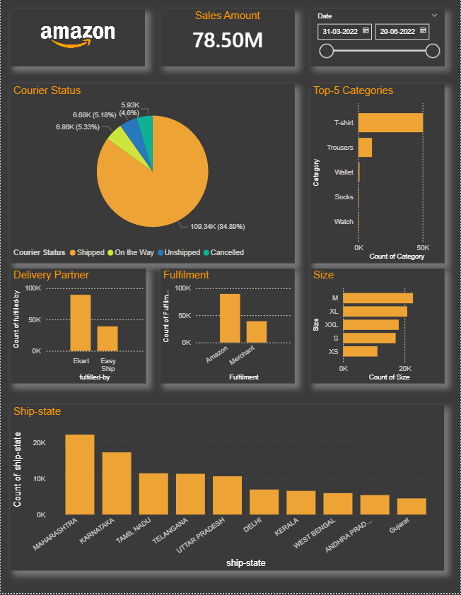

# Amazon Sales Track Dashboard

## Project Overview
Amazon Sales Track Dashboard is a Power BI project designed to monitor and analyze Amazon sales performance. The dashboard helps businesses track sales across different cities, product categories, delivery partners, and order statuses.

The project uses a dataset of more than 120,000 records collected from Kaggle. Data cleaning, preprocessing, and modeling were performed in Excel before creating interactive visualizations in Power BI.

---

## Project Objective
The main objective of this project is to provide a clear view of sales performance and order delivery status. It helps stakeholders identify sales trends, monitor logistics performance, and make data-driven business decisions.

---

## Dataset
- Source: Kaggle
- Records: 120,000+ Sales Records
- Domain: E-Commerce / Amazon Sales Data

---

## Data Cleaning & Preparation
Before creating the dashboard, the dataset was cleaned and transformed using Excel:

- Removed duplicate records
- Handled missing values using Mean, Median, and Mode
- Deleted unnecessary columns
- Corrected data inconsistencies
- Applied data filtering and validation
- Performed data modeling for better analysis

---

## Tools & Technologies
- Microsoft Excel
- Power BI
- Data Cleaning
- Data Modeling
- Data Visualization
- Business Intelligence (BI)

---

## Dashboard Features

### Sales Analysis
- Track overall sales performance
- Analyze sales by city
- Analyze sales by product category
- Identify top-performing locations

### Order Tracking
- Monitor shipped orders
- Track unshipped orders
- Track cancelled orders
- Monitor orders currently in transit

### Delivery Partner Analysis
- Compare delivery partner performance
- Analyze courier activity
- Evaluate shipment status

### Interactive Dashboard
- Dynamic filters and slicers
- Easy-to-understand visualizations
- Business-friendly insights
- Real-time analytical view of sales trends

---

## Key Insights
- Identified top-performing cities contributing the highest sales.
- Compared product category performance across different regions.
- Analyzed shipment and delivery efficiency.
- Tracked order status distribution (Shipped, Unshipped, Cancelled, On the Way).
- Evaluated delivery partner performance to improve logistics operations.
- Generated actionable insights for business growth and operational efficiency.

---

## Dashboard Screenshot

---

## Business Impact
This dashboard helps businesses:
- Monitor sales performance efficiently
- Improve delivery operations
- Reduce cancelled and delayed orders
- Understand customer demand patterns
- Make faster data-driven decisions

---

## Author
**Ujjawal Babra**
Data Analyst | Power BI | Excel | SQL | Python
